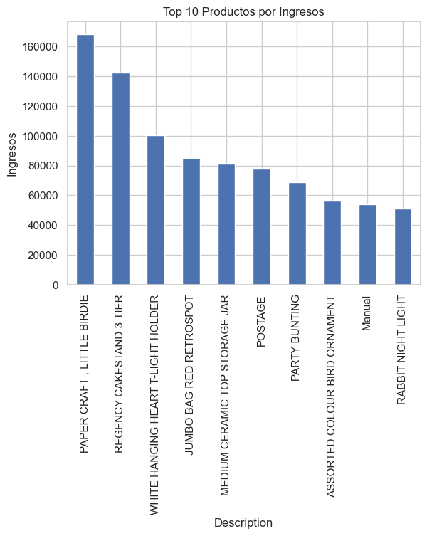
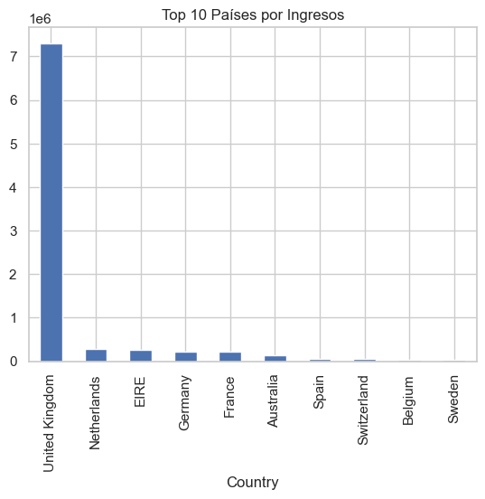
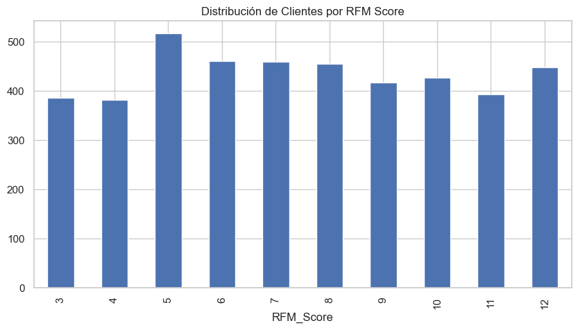

# Customer Segmentation with RFM Analysis – Online Retail

## Business Problem
A UK-based online retailer wants to understand its customer base to improve retention and target high-value segments. Using transactional data, we segment customers based on Recency, Frequency, and Monetary value.

## Dataset
- **Source:** UCI Machine Learning Repository – [Online Retail](https://archive.ics.uci.edu/ml/datasets/online+retail)
- **Content:** 541,909 transactions from 2010-2011, including returns and cancellations.
- **Goal:** Identify customer segments to guide marketing and loyalty strategies.

## Methodology
1. Data cleaning: remove returns (negative Quantity), cancellations, and rows without CustomerID.
2. Calculate RFM metrics:
   - Recency: days since last purchase (snapshot date = max date + 1)
   - Frequency: number of transactions per customer
   - Monetary: total spending per customer
3. Assign quartile-based scores (1 to 4) for each R, F, M.
4. Compute overall RFM_Score = sum of R+F+M.
5. Visualize top products, top countries, and distribution of RFM scores.

## Key Insights
- **Concentration:** A small group of customers generates most revenue.
- **Product focus:** Top 10 products account for a large share of sales.
- **Segmentation:** Clients with high frequency and monetary value should be prioritized for retention.

## Technologies
- Python 3.13
- pandas, numpy, matplotlib, seaborn
- Jupyter Notebook

## How to run
1. Clone this repository.
2. Install dependencies: `pip install -r requirements.txt`
3. Download the dataset from [UCI Online Retail](https://archive.ics.uci.edu/ml/datasets/online+retail) and place `Online Retail.xlsx` inside `data/raw/`.
4. Run `notebooks/rfm_analysis.ipynb`.

## Visuals

## Output
- `outputs/rfm_analysis.csv` contains the final RFM table for each customer.

## Contact
Julio Damian Rivera – [LinkedIn](https://linkedin.com/in/julio-damian-rivera-cruz) – damian.rivera@uabc.edu.mx
