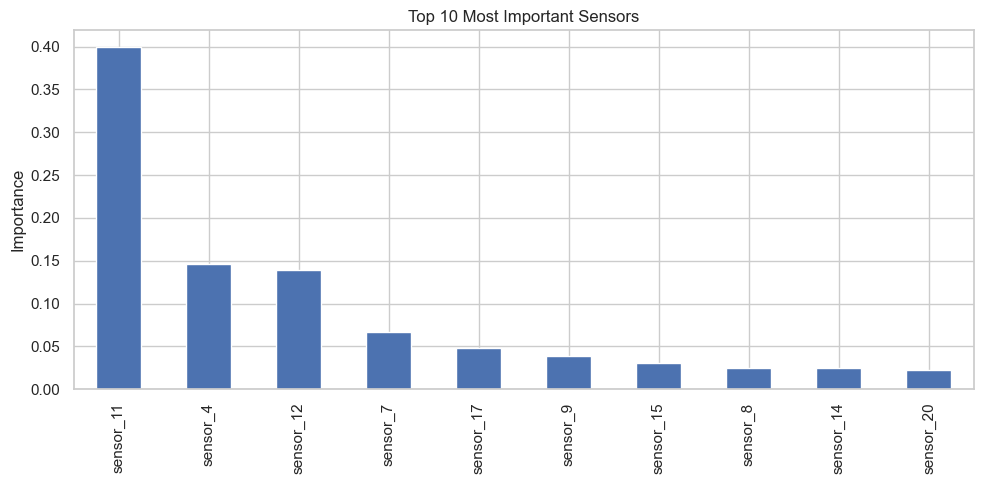
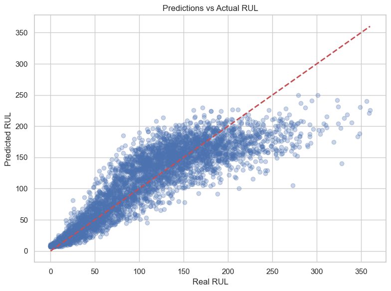
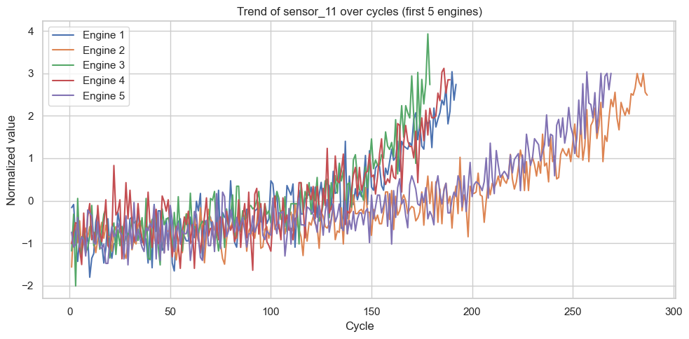

# Predictive Maintenance for Aircraft Engines (NASA CMAPSS)

## Overview

This project develops a machine learning model to predict the **Remaining Useful Life (RUL)** of aircraft engines using multivariate sensor data. The dataset is based on simulations developed by NASA, widely used in predictive maintenance research.

The model helps airlines and maintenance operators anticipate engine failures, reduce unexpected downtime, and optimize maintenance schedules.

---

## Business Problem

Unplanned equipment failures in aviation lead to:

- **High maintenance costs**
- **Unexpected flight cancellations**
- **Operational inefficiencies**

Companies need reliable ways to **anticipate failures before they occur** and schedule maintenance proactively.

---

## Solution

We build a predictive model that:

- Estimates how many cycles remain before engine failure
- Learns degradation patterns from historical sensor data
- Identifies the most impactful sensors
- Enables proactive and cost-efficient maintenance strategies

---

## Methodology

1. **Data loading & preprocessing** – Load NASA CMAPSS dataset (train_FD001.txt).
2. **Target calculation** – Compute RUL as `max_cycle - current_cycle`.
3. **Sensor filtering** – Remove sensors with low variance or constant values.
4. **Normalization** – Apply group-wise normalization per engine unit.
5. **Feature selection** – Use all remaining sensor signals as features.
6. **Model training** – Train a **Gradient Boosting Regressor**.
7. **Evaluation** – Measure performance using **Mean Absolute Error (MAE)**.

---

## Results

| Metric | Value |
|--------|-------|
| **Model** | Gradient Boosting Regressor |
| **Mean Absolute Error (MAE)** | **23.13 cycles** |
| **Top 5 most important sensors** | sensor_11, sensor_4, sensor_12, sensor_7, sensor_17 |

The model can estimate engine degradation with a relatively low prediction error (≈23 cycles), making it suitable for real-world maintenance scheduling.

---

## Key Insights

- **Sensor_11** is the most influential feature, followed by sensors 4, 12, 7, and 17. These sensors show strong correlation with engine degradation patterns.
- Feature selection (removing low-value sensors) improved model performance.
- Normalizing per engine unit captures individual degradation trends better than global scaling.

---

## Visualizations

| Feature Importance | Predictions vs Actual | Sensor Trend (top sensor) |
|:---:|:---:|:---:|
|  |  |  |

---

## Tech Stack

- **Python** 3.x
- **Pandas** – data manipulation
- **NumPy** – numerical operations
- **Scikit-learn** – machine learning (GradientBoostingRegressor, train_test_split, metrics)
- **Matplotlib & Seaborn** – visualizations

---

## Potential Applications

- **Predictive maintenance** in aviation
- **Industrial equipment monitoring** (turbines, compressors)
- **Manufacturing systems optimization**
- **Failure prediction** in mechanical systems

---

## Project Structure

